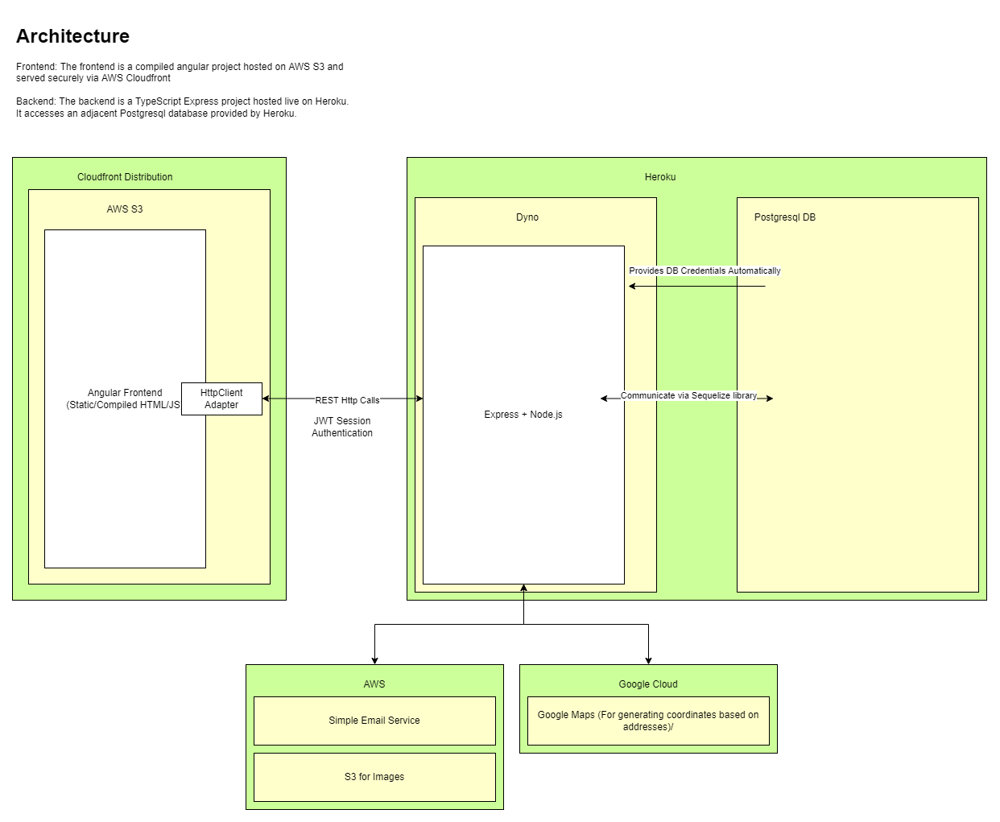

# Foster Source Respite App

## About

This is the frontend component of the Respite Source web app. The backend lives in the `fs-service` repository. The site is deployed to https://respite.fostersource.org

## System Set-Up

This project is going to be built in angular, so to develop you will need to properly set up your environment.
The commands that I'll write in this document will be geared towards Linux, and are tested on WSL 2 (Windows subsystem for linux, a Ubuntu linux terminal for Windows).

1. Ensure that you have Node and NPM (node package manager) installed.
2. Make sure that your npm version is 7.5.2 with `sudo npm install npm@7.5.2 -g`
3. Ensure that `npx` is installed globally on your machine with `sudo npm install -g npx`
4. Install the Angular command line tool with `sudo npm install -g @angular/cli`
5. Run `npm install` when cloning the fresh repository.
6. Run `npx husky install` to enable any commit/push hooks
7. I **VERY** strongly recommend using the  IDE. You are provided a free JetBrains educational license that you can acquire . If you choose not to use this, ensure that you at the very least have Typescript extensions and error checking in your code editor. This IDE can (and should) be used for the frontend and backend.

## Automatic Formatting + Code Quality

When you commit, your terminal should automatically run `prettier` (which formats your code) and `ESLint` (which checks for code quality and makes improvements when possible). If there are issues that the linter cannot fix, it will give you and error, and you will have to fix the issues and recommit.

## Service Dependency Injection (Mock vs Real Backend)

Services (primarily referring to services that make HTTP calls to the backend) have been developed in a way where they can be configured to either make real calls to the backend, or return mock data of the same promised type. This way, the frontend and backend teams can concurrently develop (or at the very least, the frontend team can develop) without waiting on each other. In other words, the frontend team can develop functionality without yet having a corresponding backend endpoint.

These mock services also provide convenient, accurate mocks to unit test the components with.

Services that make calls to the backend should be created and developed with the following pattern:

- `[service name].service.ts`
  - The abstract class that provides an interface for the implementation and mock versions of the service
- `[service name].mock.service.ts`
  - This service should implement the aforementioned interface but make no calls to the backend. Instead, it should provide functions that return mock data from the `mock/database-entities.ts` file.
  - While this service will not exactly mimic the real implementation (for example, making a call with different parameters may return the exact same mock result), it can be used for development and testing purposes
- `[service name].impl.service.ts`
  - This service will make actual HTTP REST calls to the backend.
- `[service name].service.provider.ts`
  - This is a simple factory to assist Angular with providing your app with the correct version. The version to provide is determined by the environment variables in `src/environments/environment.ts` and `src/environments/environment.prod.ts` (though of course the production version should have all of the options set to `true`)

## CI/CD

This project is set up with a (admittedly fairly rudimentary) CI/CD pipeline that automatically builds and deploys the project to production. The steps are as follows:

1. A pull request is merged into the `main` branch on the Github
2. A Github webhook tells AWS codebuild that the project has been updated
3. AWS Codebuild uses the `buildspec.yaml` file to compile the TypeScript project into static HTML and JS files
4. The produced artifacts are automatically dumped into the `respite.fostersource.org` AWS S3 bucket
5. AWS Cloudfront detects that the files in the bucket have been updated, and redeploys the site
6. When AWS Cloudfront finishes its deployment, an AWS Lambda function invalidates the cache (which results in new requests to the site fetching it directly from the newly updated bucket) so the newly deployed site is available to end users.

## Testing

Run the command `npm run test`.

If you are using Windows + WSL (Windows Subsystem for Linux):

- The angular testing system uses Google Chrome to run the tests. If you are on a virtual subsystem like WSL, it is likely that there is no chrome installed and so you will not be able to run tests.
- Use [this link](https://www.gregbrisebois.com/posts/chromedriver-in-wsl2/) to setup to run tests. You may skip "The X Server" step

## Git

### Branches

Our main branches will be `main` and `current-sprint`. `main` needs to always be completely stable and functional. It will be updated at the end of each of our sprints (optimally every
week or two weeks). `current-sprint` will be the branch that we are working off of each sprint. When working on your feature, make sure to branch off of
current-sprint.

- `git checkout current-sprint`
- `git checkout -b [your branch name]`

### Committing

This project is set up in a way that (hopefully) will run both stylistic and functional checks against your code everytime that you
attempt to commit. If there are errors, you will not be able to commit until you fix the errors, re-add and recommit your work
I understand this will probably be pretty annoying, but it ensures consistency and readability across our code-base. If there are
errors that you believe are a result of an issue in the setup and configurations of these tools, please let Jett know.

Make sure to commit often! It will be much easier to fix errors incrementally rather than all at once before pushing.

When pushing, the test suite will be run. You will not be able to push until all tests pass.

- `git add .`
- `git commit -m "WHAT CHANGED?"`
- `git push --set-upstream origin [your branch name]` (only needs to be run the first time you push off of this branch. Subsequent pushes can be made with `git push`)

### Merging

All pull requests will need to pass through a code review and receive two OK's before they are merged into current sprint, one from Jett and one from another team member.
Merges/pull requests can be initiated from the Github web interface. Make sure to detail all of the changes you've made in your branch in the description.

...

### Angular Help

This project was generated with [Angular CLI](https://github.com/angular/angular-cli) version 12.2.7.

## Development server

Run `ng serve` for a dev server. Navigate to `http://localhost:4200/`. The app will automatically reload if you change any of the source files.

## Code scaffolding

Run `ng generate module [module name]` to generate a module.  
Run `ng generate component [module name]/component-name` to generate a new component. You can also use `ng generate directive|pipe|service|class|guard|interface|enum|module`.
Run `ng generate service services/[service name]/[service name]` to generate a service. The two service names are intentional to place the service in a subdirectory with the same name.

## Build

Run `ng build` to build the project. The build artifacts will be stored in the `dist/` directory.
